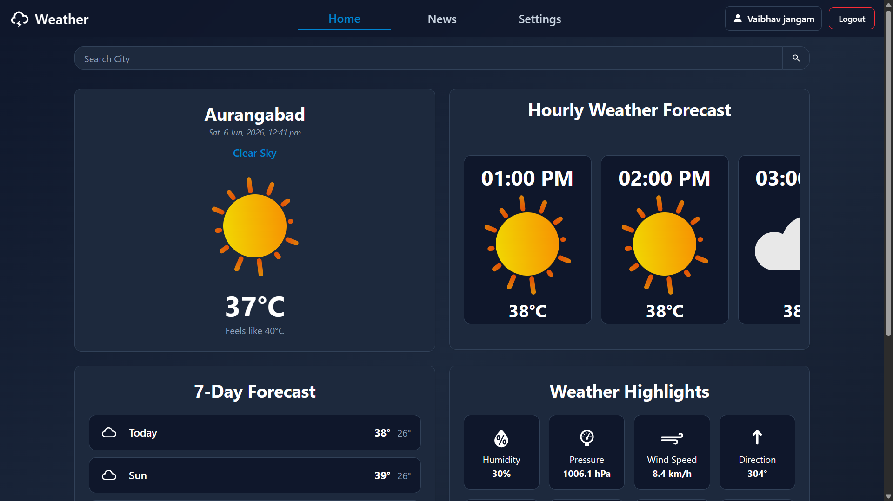
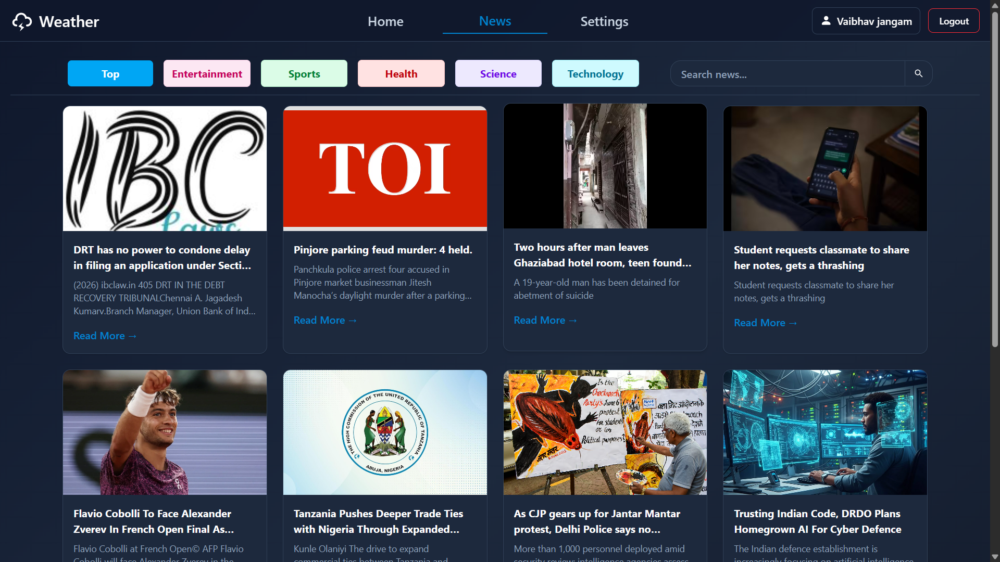
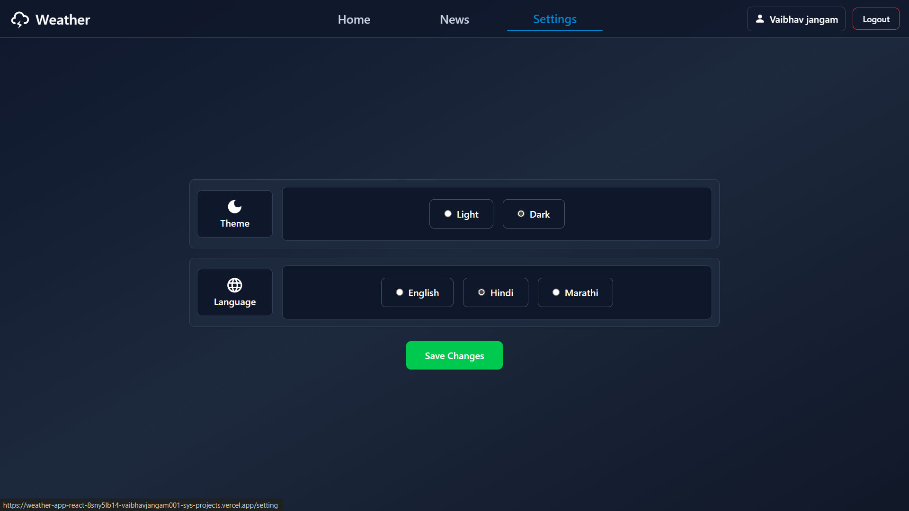
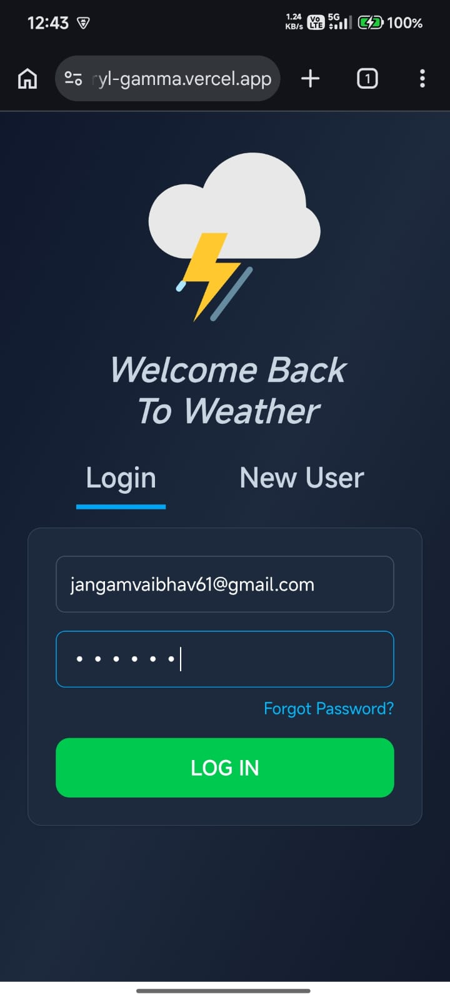
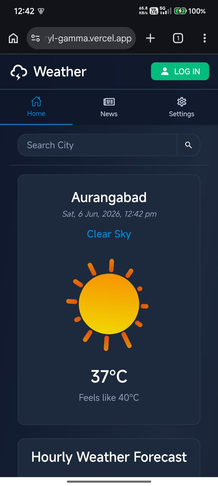
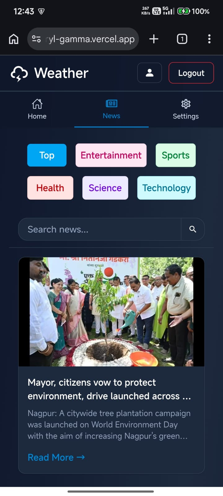

# 🌦️ Weather App

## Description

A modern Weather and News application built with React.js, Redux, and Firebase Authentication.

Users can search weather information for any city, view detailed weather forecasts, read the latest news articles, manage their profiles, and customize the application with theme preferences.

---

## Features

* 🌍 Search weather by city
* 🌐 Multi-language Support
* 🌡️ View temperature, humidity, and weather conditions
* 📅 Weekly weather forecast
* 📰 Read latest news articles
* 🔐 User Authentication (Login & Signup)
* 🌙 Dark and Light Theme
* 👤 User Profile Management
* 📱 Fully Responsive Design
* 🚀 Fast and Optimized Performance

---

## Tech Stack

### Frontend

* React.js
* Vite
* React Router DOM
* Redux

### Authentication

* Firebase Authentication

### APIs

* Weather API
* News API

### Deployment

* Vercel

---

## Live Demo

🔗 Live Website: https://weather-app-react-beryl-gamma.vercel.app/

🔗 GitHub Repository: https://github.com/vaibhavjangam001-sys/weather-app-react

---

## Screenshots

### Home Page



### News Page



### Settings Page



### Login Page



### Mobile Home



### Mobile News



---

## File Structure

```text
weather-app-react/
│
├── public/
│
├── screenshots/
│
├── src/
│   ├── assets/
│   ├── components/
│   │   ├── animation/
│   │   ├── auth/
│   │   ├── news/
│   │   └── weather/
│   │
│   ├── firebase/
│   ├── layouts/
│   ├── pages/
│   ├── redux/
│   │   ├── actions/
│   │   ├── reducers/
│   │   └── types/
│   │
│   ├── services/
│   ├── utils/
│   │
│   ├── App.jsx
│   ├── index.css
│   └── main.jsx
│
├── .gitignore
├── package.json
├── vite.config.js
├── vercel.json
└── README.md
```

---

## Installation

### 1. Clone the repository

```bash
git clone https://github.com/vaibhavjangam001-sys/weather-app-react.git
```

### 2. Navigate to the project directory

```bash
cd weather-app-react
```

### 3. Install dependencies

```bash
npm install
```

### 4. Create a .env file

```env
VITE_WEATHER_API_KEY=your_weather_api_key
VITE_NEWS_API_KEY=your_news_api_key
```

### 5. Run the application

```bash
npm run dev
```

---

## Author

**Vaibhav Jangam**

GitHub:
https://github.com/vaibhavjangam001-sys

---

## License

This project is created for learning and portfolio purposes.
